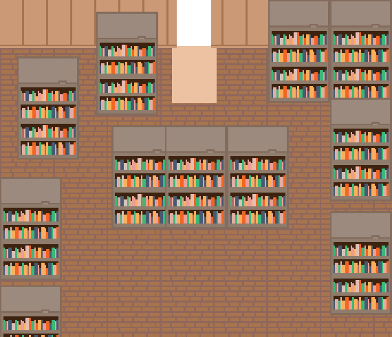

`*This Image Taken Before Disaster`
</br>

Nama Game : **Flooding in Gensokyo ; The Random Perspectif**
</br>
Character : **Reimu, Marisa, Yukari, Ran, Chen, Kosuzu, Eiki**
</br>
Genre : **RPG, Puzzle, Touhou, Dash Game
</br>**
Author : [Agus Chandra](https://fb.me/banana.garuda)
</br>
Programming : [Agus Chandra](https://fb.me/banana.garuda)
</br>
Level Design : [Agus Chandra](https://fb.me/banana.garuda)
</br>
Music Design : [Agus Chandra](https://fb.me/banana.garuda), Widiatmika
</br>

Tampilan : 2D / 2,5D Perspektif maybe
</br>
Design : *Pixel Art Dari Aku Sendiri Yang Buat / Ngambil Foto Dari Google jika udh `deadline`
</br>
UI Design : Saya sendiri
</br>
Engine : [**Unity 2D**](https://unity.com/)
</br>
Text Editor : [**Visual Studio Code**](https://code.visualstudio.com/)
</br>

Game Music : [**Fl Studio 20**](https://www.image-line.com/flstudio/) / Minta Bantuan Temen yg bisa buat soundtrack / ngambil dri google
</br>
Programming : Klo Udh Stuck Cari Youtube Atau Nanya Ke Mastah `Programming` `C#` / Ke Dosen yg pernah buat game

Translating : `Alfa WF` in English 
(yeah you know i’m not fluent of english language / siapapun boleh sih

Uploading in : kajikasama itch account di event Touhou Jam 6 maybe
My Itch : [Kajikasama](https://kajikasama.itch.io/)

</br>

>__<h1>URGENT!!</h1>__

**`JIKALAU BENAR-BENAR IKUTAN TOHOU JAM 6 MAKA HARUS SELESAI SEBELUM DEADLINE YAITU 3 HARI !! / SEHARI FULL`**

Kita Punya Waktu Lagi 4 Bulan Dari Sekarang

<br>

__<h2>`Pokok Permasalahan`</h2>__

Di wilayah `gensokyo` tiba-tiba terjadi genangan air yang ntah dari mana datangnya dan membuat seisi wilayah terendam banjir bandang yang besar dan arus yang kuat.
dari kuil hakurei sampai ke neraka lama ..

ini bukan bajir biasa banjir ini dapat melenyapkan kayu dan perapian dengan sangat gampang dan arus nya bisa lebih cepat dari arus air sungai sekalipun yang dimana terdapat youkai ntah dari mana asalnya yg ingin menenggelamkan gensokyo

para penduduk manusia yang tinggal di pemukiman berusaha evakuasi tetapi cara ini kurang berhasil. reimu marisa dan kawan-kawannya bertugas utk menyelamatkan semua penduduk yang terendam banjir tersebut. dan sisa nya utk membantu mebenarkan rumah mereka selagi bisa.

</br>

__<h2>`Resolusi Berhasil`</h2>__

reimu dan marisa sengaja berkunjung ke suzunaan utk meminjam buku dan memastikan utk tidak ada keganjilan di daerah sana ..

tiba-tiba mereka tidak sengaja membuka buku tentang youkai banjir ntah seperti apa mahluk tersebut yang pasti itu bakal jadi insiden yang terberat yang pernah mereka alami

>**Good Ending 1** : semua penduduk selamat dan rumah selesai di perbaiki dan semua barang baik-baik saja

>**Good Ending 2** : semua penduduk selamat tetapi perlu perbaikian dari rumah minimal jangan menyentuh 200% utk ke ending ini

>**Good Ending 3** : Rumah Hancur tetapi masih ada jalan untuk memperbaiki dengan item dan sisa penyelamatan barang-barang tersebut

</br>

__<h2>`Resolusi Gagal`</h2>__

jikalau point banjir / BP = 100% maka air sudah masuk sampai kedalam secara keseluruhan di pemukiman

jikalau point banjir / BP Max = 200% maka air dapat merobohkan rumah dan di haruskan segera keluar dari tempat tersebut segera sebelum anda tewas

>**Bad Ending 1** 
rumah / pemukiman hancur lebur dan penduduk pindah ke bulan

>**Bad Ending 2** 
mati karena tertimpa reruntuhan Rumah / pemukiman akibat tidak keluar 

>**Bad Ending 3** 
rumah selamat semua penduduk selamat tetapi semua barang benar-benar hanyut dan tak bersisa (seharusnya memungut sesuatu yg penting min 30% item)

>**Bad Ending 4 alternative 1**
hakurei barrier gagal di perbaiki yukari & rumah hancur total

>**Bad Ending 5 alternative 2** semua keluarga yakumo tewas akibat reruntuhan dan bakal di summon ke yama utk di review nantinya sebelum di cabut nyawa nya 

>**Bad Ending 6 alternative 3** barang hilang semuanya 

>**Bad Ending 7** mati karena kehabisan stamina titk kemampuan sudah melebihi batas / tenggelam

Semua Penduduk Dan Seisi Gensokyo Benar-Benar Terendam Jikalau Itu Terjadi Dan Semua rata dengan air mereka yang bisa terbang di gensokyo akan kehilangan kekuatannya mereka sendiri juga dan akhirnya mati dan game over ..

</br>

**<h2>`Perspektif Karakter`</h2>**


`Perspektif Reimu Hakurei / Marisa Kirisame`
</br>
HP : `250` + `240`
</br>
MP : `50` + `60`
</br>
SP : `80` + `80`
</br>
sama seperti pokok permasalahan pertama tetapi disini kecepatan bukan hanya evakuasi orang saja tetapi semua barang-barang penting mungkin saja itu uang ata emas hanyut

marisa bertugas utk memungut semua buku yang berada di perpustakaan nya kosuzu

```
Kadang Acak Setiap Perspektif
Acak Persektif Tetapi Akan Lebih banyak status pointnnya
```

**`Perspetif Yukari Yakumo`**
</br>
>
</br>
HP: `500`
</br>
MP: `50`
</br>
SP: `30` + `50`

genangan ini kenapa bisa masuk sampai di hakurei barrier iya ?
yukari bertugas untuk  menyelamatkan semua penduduk yg berada dekat pemukimannya dan memperbaiki hakurei barrer yang dirusak oleh banjir misterius tersebut

*Teleport Special effect Kereta*

**`Perspektif Ran`**
</br>
HP : `250`
</br>
MP : `50`
</br>
SP : `50`
</br>

Menjaga Agar Air Tidak Masuk Sampai Ke Kamar Tidur / Tempat Makan dan Berusaha Menyelamatkan Chen jikalau Tenggelam

*Shikigami Multitasking, Special effect dapat berkomunikasi kepada semua keluarga Yakumo (chen , yukari)*

**`Perspektif Chen`**
</br>
HP : `150`
</br>
MP : `50`
</br>
SP : `30`
</br>
Membantu Yukari dan Ran untuk mengamankan semua barang-barang di seluruh kamarnya 
**Kecepatan** yang diutamakan pada perspektif ini

**`Perspektif Kosuzu Motoori`**
</br>
>
</br>
HP : `400`
</br>
AP : `50 `+` 20`
</br>
SP : `30`
</br>
berusaha untuk menyelamatkan semua buku dan gulungan suci di suzunaan ..
</br>**Menulis sesuatu dapat menambah `AP` secara drastis**

**`Perspektif Eiki Shiki`**
</br>
>
</br>
HP : `2500`
</br>
MP : `500`
</br>
SP : `500` + `100`
</br>
berusaha meyakinkan agar mereka semua bisa menyelamatkan gensokyo lagi 
<br>
Yama membuat effect Kebal Selama `5` `Menit`


__<h2>Gameplay & Items</h2>__

Singkatan  | Akronim   | Fungsi
----------- | ---------- | ---------
**HP** | Health Point | Untuk Darah Dari Suatu Karakter (alias tingkat kesehatan)
**SP** | Stamina Point | Untuk Melakukan Aksi Seperti Berlari, Menyerang ,Menangkis, Dll
**MP** | Magic Point | Untuk Skill maupun Spell Card (Kecuali Kosuzu & Penduduk) dapat saat menyerang youkai
**AP** | Alpha Point | Pengganti MP pada kosuzu (di dapatkan saat menulis sesuatu karangan)
**BP** | Banjir Point | Pengukuran Air di pemukiman (0-200%)
**SPt** | Skill Point | Satuan Skill Point Utk upgrade skill terbaru
**Rp.** | Rupiah | Mata uang Rupiah (bisa di tukar di daiyosei / mystia)
**Y.** | Yen | Mata Uang Resmi Utk Membeli Barang dan Rumah
**Ltr** | Liter | Jumlah item dlm bentuk cairan
**Pcs** | Picis | Jumlah item / Satuan Item
**^** | pangkat | yang akan di kalikan jikalau terjadi kerugian maupun keuntungan  
**EXP** | Experience | Alias Pengalaman didapatkan saat menyerang maupun menyelamatkan sesuatu  
**Pt** | Point | Score Point jika menyentuh score tertentu mendapatkan tambahan EXP   
**Lvl** | Level | Level Character (0-100) maupun lebih
**°C** | Celcius | Satuan Suhu Permukaan maupun suhu tubuh (di periksa di nitori)

Item  

No|Nama Item | Satuan    | Kelangkaan
-----|--------- | ----------| -------
1|Makanan & Minuman | Pcs | Mudah didapatkan (95%)
2|Pedang Kayu | Pcs | Mudah didapatkan (85%)
3|Gohei Kayu | Pcs | Agak sulit (60%)
4|Sapu Ijuk | Pcs | Agak sulit (60%)
5|Hakugyou | Pcs | Sulit (30%)
6|Kipas Pelangi | Pcs | Sangat Sulit (20%)
7|Gulungan Suci | Pcs | Agak Sulit (34%)
8|Buku Youkai | Pcs | Agak Sulit (36%)
9|Kardus | Pcs | Mudah didapat (98%)
10|Potion HP | ltr | Agak Sulit (35%)
11|Potion MP | ltr | Agak Sulit (34%)
12|Potion SP | ltr | Agak Sulit (38%)
13|Potion AP | ltr | Agak Sulit (30%)
14|Potion EXP | ltr | Sulit Sekali (15%)
15|Jerigen Bensin | ltr | Agak Sulit (26%)
16|Yama Summoner | Pcs | `Mustahil (1%)`
17|Kartu Kredit | Pcs | `Mustahil (1%)`
18|Pakaian | Pcs | Mudah didapatkan (100%)

>Rate Item Keseluruhan **42% **/** Perdetik**

>Adanya System **Inventory**


```
System level aku akan dikalikan 1/4 kali jumlah exp level sebelumnya ..
```


```
Easter Egg : Coming Soon ...
```

Mungkin Bakal Ada System Pengacakan Perspektif Selama 25 Menit ntah itu sebagai Reimu Maupun yg lainnya ..

Dan Pengacakan Tugas / Quest nya dari mana pun 
(contoh :  kosuzu ngebantu yukari nyelamatin chen)
(contoh : reimu membantu marisa menyelamatkan suzunaan dari banjir)


> `Point Plus`
* adanya Point Score Seperti Uang, Emas, Perhiasan, Dan Barang Hanyut Lainnya
* Menjaga Agar Semua Rumah Tidak Hancur Gara-Gara Banjir
* Air Masuk Dihitung Dengan Persenan Jika melebihi 100% pemukimanbenar-benar tenggelam jikalau sudah max 200% rumah bakalan hancur dan game over
* tinggi air bisa sampai 3 mtr (ini gimana ngukurnya cuk ??)
* Adanya Skill Point Saat Naik Level (nambahin stat doang )
Penambahan Fitur Suhu Tubuh 


> `Point Minus`    
- Adanya Stamina jikalau di gunakan terus menerus dan terkena genangan air atau bahkan tenggelam dapat mengurangi HP
- Penambahan Youkai Air Ntah itu wakasagi maupun teman-temanya (boss maybe)
- ada senjata yang dapat rapuh maupun sekali pakai
- Item dapat hilang dalam 1 menit bahakan 10 detik jikalau tidak di ambil saat hanyut
- pergerakan agak sedikit lambat / agak sedikit cepat 
- tehnik lari menggunakan stamina (gunakan dengan baik)
- jikalau HP sudah menyentuh angka 0 atau di bawah maka anda mati dan memutuskan untuk bertemu yama / tidak
- Yama Datang Utk pemperingan atau memperbeban semuanya itu tergantung 
- Penambahan suhu tubuh jikalau menyentuh 32C maupun kurang dari itu atau malah diatas 38 C maka ada effect bersim dan pengurangan HP sebanyak 1% dari total HP (Keadaan Karakter Tidak Sehat)

</br>

Tolong Donasikan Ke [Kajikasama](https://kajikasama.itch.io/) agar ~~saya bisa makan enak pokoknya~~ *plak saya bisa semangat melanjutkan game ini ...

**The Girls Are Preparing To Developing Please Wxait...**

